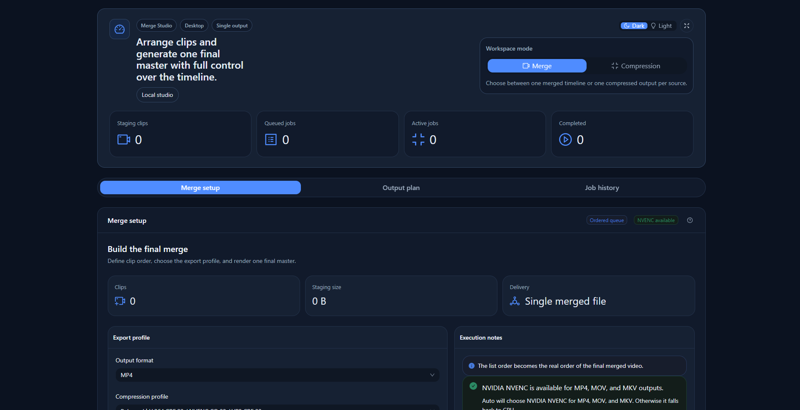

# 🎬 Video Merger Desktop

<p align="center">
  <strong>Desktop-first video merge and compression studio built with Electron, Vite, React, TypeScript, FFmpeg, Zustand, and Ant Design.</strong>
</p>

<p align="center">
  
  
  
  
  
  
  
  
  
  
</p>

<p align="center">
  <a href="https://github.com/d4v3-rm/dsk-electron-video-merger">Repository</a>
  ·
  <a href="https://d4v3-rm.github.io/dsk-electron-video-merger/">Website</a>
  ·
  <a href="https://github.com/d4v3-rm/dsk-electron-video-merger/issues">Issues</a>
</p>

<p align="center">
  
</p>

> 🏷️ Tags: `#electron` `#desktop` `#ffmpeg` `#video-merging` `#video-compression` `#vite` `#react` `#typescript` `#zustand` `#ant-design` `#nvenc`

## 🚀 Overview

Video Merger Desktop is a desktop-only video workstation focused on two practical jobs:

- merging ordered clips into one final deliverable
- compressing source videos individually with one shared export profile

This repository does **not** use a database and does **not** ship a client/server web stack. The application runs as a local Electron desktop app, with Node.js handling the video pipeline and React handling the workspace UI.

## ✨ Feature Snapshot

| Area                   | What it does                                                                                  |
| ---------------------- | --------------------------------------------------------------------------------------------- |
| 🎞️ Merge mode          | Concatenates clips in the exact order defined in the queue and renders one final file         |
| 🗜️ Compression mode    | Encodes each selected source video independently using a shared export profile                |
| 📦 Output formats      | Supports `mp4`, `mov`, `mkv`, and `webm`                                                      |
| 🧭 Destination control | Lets the user choose a custom output folder or fall back to the app-managed output directory  |
| ⚙️ Encoding profiles   | Exposes `light`, `balanced`, and `strong` compression presets with technical labels in the UI |
| 🖥️ GPU support         | Can prefer NVIDIA NVENC for supported containers when available                               |
| 📡 Telemetry           | Streams FFmpeg progress, status text, runtime metrics, and detailed job logs                  |
| 🧾 History             | Stores local job history for quick review and output path access                              |
| 🌐 Presentation site   | Includes a standalone product website workspace under `website/`                              |
| 🪟 Packaging           | Produces a Windows portable executable                                                        |

## 🧪 Product Scope

### Desktop only

The project is intentionally desktop-first:

- no REST API
- no web client/server split for the app runtime
- no database dependency
- no background cloud service

### Practical workflow

The application is designed for real local media operations:

1. select videos
2. choose the operating mode
3. configure format, compression, backend, and destination folder
4. start the job
5. monitor progress and logs
6. reopen the generated artifact locally

## 🧰 Operating Modes

| Mode          | Input model               | Output model               | Best use case                                               |
| ------------- | ------------------------- | -------------------------- | ----------------------------------------------------------- |
| `Merge`       | Ordered timeline of clips | One final merged file      | Course modules, demos, recordings, stitched timelines       |
| `Compression` | Independent source files  | One output file per source | Batch size reduction, delivery copies, archive optimization |

## 🎛️ Containers, Codecs, and Backends

| Container | Typical codec path in this app           | Backend support     |
| --------- | ---------------------------------------- | ------------------- |
| `MP4`     | H.264 + AAC                              | CPU or NVIDIA NVENC |
| `MOV`     | H.264 + AAC                              | CPU or NVIDIA NVENC |
| `MKV`     | H.264-based workflow in the app pipeline | CPU or NVIDIA NVENC |
| `WebM`    | VP8/VP9-oriented software path           | CPU only            |

### NVIDIA acceleration

When NVIDIA NVENC is available, the app can use it for supported output containers.

- `Auto` prefers NVIDIA NVENC where supported
- unsupported combinations fall back to CPU automatically
- WebM remains CPU-only in the current pipeline

## 🧭 UI and Workspace Design

The renderer is organized as a dashboard-style workspace:

- **Hero / overview panel** for mode switching, workspace status, and key metrics
- **Workspace switcher** to move between setup, output plan, and job history
- **Setup panel** for source selection, ordering, export profile, backend, and destination folder
- **Output plan panel** for runtime summary, generated output naming, and latest artifact
- **Job history panel** for completed, queued, active, and failed jobs
- **Job details drawer** for logs, progress, telemetry, input list, and output list
- **Codec guide modal** rendered from Markdown for detailed codec/container guidance

## 📁 Output Behavior

The generated files are written to:

- a user-selected destination folder, when explicitly chosen
- the app-managed output directory otherwise

Temporary processing assets remain isolated from final outputs so the generated deliverables stay available after the job ends.

## 🧱 Architecture

### Runtime split

- `src/main`: Electron main process, IPC, FFmpeg orchestration, storage, file dialogs
- `src/renderer`: React UI, Zustand state, Ant Design workspace, i18n resources
- `src/shared`: Shared types for IPC, jobs, hardware, and video models
- `website`: standalone presentation website sources powered by Vite + React + TypeScript

### Key responsibilities

| Layer                         | Responsibility                                             |
| ----------------------------- | ---------------------------------------------------------- |
| `main.ts`                     | Electron bootstrap, window lifecycle, dev/prod behavior    |
| `preload.ts`                  | Secure bridge between renderer and main process            |
| `ipc/ipc-routes.ts`           | Main-process IPC contract wiring                           |
| `services/ffmpeg.service.ts`  | FFmpeg execution and media processing orchestration        |
| `services/job.service.ts`     | Job orchestration, queue management, progress broadcasting |
| `services/storage.service.ts` | Temp/output directory resolution and file system handling  |
| `renderer/store`              | Zustand slices for workspace, jobs, settings, and UI state |
| `renderer/i18n`               | English localization resources split by domain             |
| `website/src`                 | Presentation website UI, motion, and screenshot showcase   |

### Project map

```text
assets/
src/
  main/
    config/
    ipc/
    services/
      job/
  renderer/
    components/
      job-composer/
      overview/
    content/
    i18n/
      resources/
    services/
    store/
      slices/
    styles/
    theme/
  shared/
website/
  src/
    components/
    content/
    theme/
scripts/
.github/workflows/
build/
```

## 🛠️ Development

### Requirements

- Node.js 20+
- npm 10+
- Windows environment for portable packaging output

### Install

```bash
npm install
```

### Run the desktop app in development mode

```bash
npm run dev
```

### Run the presentation website in development mode

```bash
npm run dev:website
```

### Main scripts

| Command                   | Purpose                                                       |
| ------------------------- | ------------------------------------------------------------- |
| `npm run dev`             | Start renderer + Electron development mode                    |
| `npm run dev:website`     | Start the standalone presentation website locally             |
| `npm run build`           | Build main process, renderer, and Windows portable package    |
| `npm run build:portable`  | Alias for the portable build flow                             |
| `npm run build:main`      | Compile the Electron main process                             |
| `npm run build:renderer`  | Build the Vite renderer bundle                                |
| `npm run build:website`   | Build the presentation website bundle                         |
| `npm run preview:website` | Preview the built website locally                             |
| `npm run typecheck`       | Run TypeScript checks for shared, main, renderer, and website |
| `npm run lint`            | Run ESLint across the repository                              |
| `npm run format`          | Run Prettier on source, website, scripts, and root configs    |
| `npm run set:version`     | Recompute the project version from conventional commits       |
| `npm run generate:icon`   | Regenerate the application icon assets                        |

## 📦 Build and Release

### Portable build

```bash
npm run build
```

Expected packaged output:

- `dist/packaged/Video Merger Desktop-<version>-portable.exe`

### Website build

```bash
npm run build:website
npm run preview:website
```

### Release automation

The repository includes a GitHub Actions workflow at [desktop-release.yml](./.github/workflows/desktop-release.yml) that:

- installs dependencies
- builds the portable Windows artifact
- archives the source tree
- generates categorized release notes from conventional commits
- publishes a GitHub release when triggered on the configured branch

### Versioning

The repository also includes [`scripts/set-version.mjs`](./scripts/set-version.mjs), which derives the version from commit history using conventional commit semantics.

## 🧹 Tooling Standards

- **Electron + Vite + React + TypeScript** desktop stack
- **Zustand** for application state
- **Ant Design** for the component system and theme layer
- **ESLint** and **Prettier** for static quality and formatting
- **No unit test suite**, by project requirement
- **Monorepo-style structure without server/database layers**, but still split by runtime and responsibility

## 🔍 Troubleshooting Notes

### Outputs are not visible in the UI yet

Check:

- the selected destination folder
- the latest artifact block in the output panel
- the job details drawer for the full output path

### Progress appears slower near the end

The UI now uses FFmpeg-driven telemetry and job logs, but the final stages can still spend time on muxing or file finalization even when percent changes slow down.

### GPU path is not selected

Check:

- whether NVIDIA hardware is available on the machine
- whether the selected container supports NVENC in the current app pipeline
- whether the backend is set to `Auto` or `NVIDIA NVENC`

## 📜 License

This project is released under the **MIT License**.

See [LICENSE](./LICENSE) for the full text.
